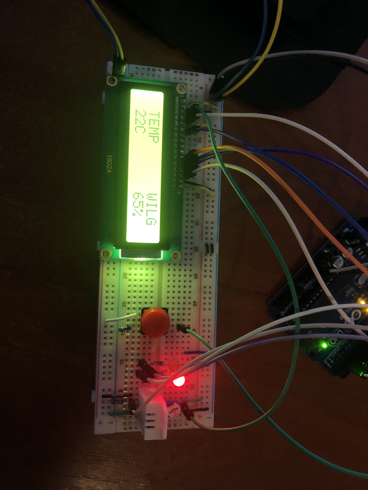
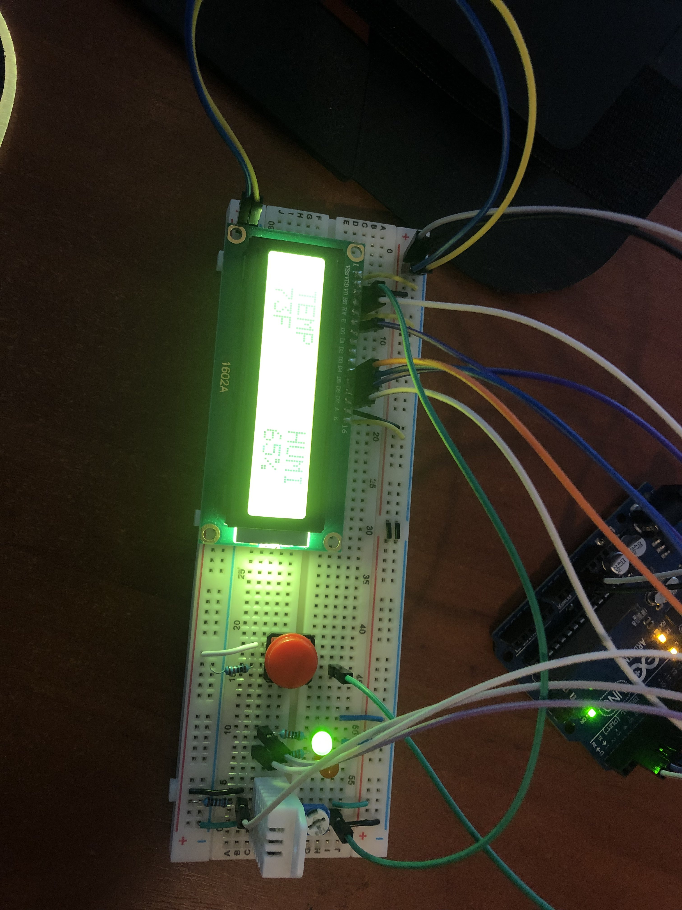

# Stacja pogodowa
Stacja pogodowa wyswietlająca temeraturę i wilgotność w języku Polskim oraz Angielskim.
# Opis projektu
 Elementy do wykonania projektu:
 - Płyta Arduino Uno
 - Płyta stykowa
 - Wyświetlacz LED
 - Przycisk
 - Rezystory (10kΩ, 4.7kΩ, 220Ω)
 - Kable męsko-męskie
 - Zworki 
 - Diody LED
 - Moduł DHT22
 - Potencjometr 10kΩ
 
Stworzony układ wyświetla na wyświetlaczu LED wilgotność powietrza oraz temperaturę w Celsjuszach i Farenheitach pobieraną z czujnika DHT22. Dzięki przyciskowi możemy wybrać czy chcemy wyświetlić temperaturę  w Celsjuszach czy Fahrenheitach oraz ustawić w języku angielskim lub polskim co sygnalizuje diod LED (Zielona dla F, czerwona dla C).


Na początek należało dodać biblioteki.
``` cpp
#include <LiquidCrystal.h>                       // Biblioteka do ekranu LCD
#include <Adafruit_Sensor.h>                     // Bilbioteka do   sensora DHT22
#include <DHT.h>                                 // Biblioteka do czujnika DHT22
```

Następnie zdeklarowane zostały Piny dla poszczególnych elementów wkorzystanych w ćwiczeniu.
``` cpp
#define DHT_PIN 6                                 // PIN cyfrowy podlaczony do DHT22
#define DHTTYPE DHT22                             // Zdefiniowany typ DHT w tym przypadku DHT22
const int buttonPin = 9;                          // PIN do guzika
const int rledPin =  8;                           // PIN do czerwonego LEDA
const int gledPin =  7;                           // PIN do zielonego LEDA
int buttonState = 0;
int klik = 0;
int button = 0;
bool CF = true;
DHT dht = DHT(DHT_PIN ,DHTTYPE);
LiquidCrystal lcd(12, 11, 5, 4, 3, 2);            // Podlaczone PINY wyswietlacza LCD
```

Ustawiono wyświetlanie tekstu na wyświetlaczu, uruchomiono sensor oraz zdefiniowano diody LED jako wyjście.

``` cpp
void setup()
{
  pinMode(rledPin, OUTPUT);                       // Ustawienie czerwonego LEDA jako wyj
  pinMode(gledPin, OUTPUT);                       // Ustawienie zielonego LEDA jako wyj
  pinMode(buttonPin, INPUT_PULLUP);
  lcd.begin(16, 2);
  lcd.print(" TEMP      WILG");                   // Wyswietlenie napisu
  Serial.begin(9600);
  dht.begin();                                    // Uruchamia sensor DHT22
}
```
Przypisano zmienne wartość temperatury w Celsjuszach, Farenheitach oraz wilgotność powietrza.

``` cpp
 void loop()
{
  float tempC = dht.readTemperature();     // Temperatura C
  float tempF;                             // Temperatura F
  float humidity = dht.readHumidity();     // Wilgotnosc
```
Sprawdzenie poprawności działania czujnika DHT22.
``` cpp
if (isnan(humidity) || isnan(tempC))              // Sprawdza blad z czujnika DHT22
    {
      Serial.println(F("Brak odczytu z DHT!"));   // Zwraca blad w Serial Monitorze
      return;                                     // Powtarza jak jest blad
    }
```
Sprawdzenie stanu guzika.
``` cpp
buttonState = digitalRead(buttonPin);            // Odczytanie stanu przycisku
  
  Serial.print("  -  ");                          // Separator
  Serial.print("Stan przycisku:  ");              // Wyswietla napis
  Serial.println(buttonState);                    // Wypisuje stan przycisku w Serial Monitor
```
Wyświetlenie temeratury w Celsjuszach, nazw w języku Polskim, oraz zapalenie się czerwonej diody.
``` cpp
button = buttonState;                           // Stan guzika w zmiennej
  if(klik==0 && button==1)
  {
  CF = !CF;
  }
  klik = button;
  
  if (CF)                                        // Wybór pomiędzy C lub F
    {

      digitalWrite(gledPin, HIGH);               // Zapala zielonego LEDA
      digitalWrite(rledPin, LOW);                // Gasi czerwonego LEDA
      tempC;                                     // Czyta wartosc temperatury w C

      Serial.print("Temperatura: ");             // Wyswietla napis
      Serial.print(tempC);                       // Wypisuje temperature w C
      Serial.print("°C");                        // Wyswietla napis
      Serial.print("  -  ");                     // Separator
      Serial.print("Wilgotnosc: ");              // Wyswietla napis
      Serial.print(humidity);                    // Wypisuje wilgotnosc w %
      Serial.print("%");                         // Wyswietla napis


      lcd.setCursor(0, 0);
      lcd.print(" TEMP      WILG");              // Wyswietla napis
      lcd.setCursor(1,3);                        
      lcd.print(round(tempC));                   // Wypisuje temperature w C
      lcd.print("C       ");                     // Wyswietla napis
      lcd.print(round(humidity));                // Wypisuje wilgotnosc w %
      lcd.print("%   ");                         // Wyswietla napis
    }

```



Wyświetlenie temeratury w Fahrenheitach, nazw w języku Angielskim, oraz zapalenie się zielonej diody.

``` cpp
else
    {   
      digitalWrite(gledPin, LOW);                // Gasi zielonego LEDA
      digitalWrite(rledPin, HIGH);               // Zapala czerwonego LEDA
      tempC;                                     // Czyta wartosc temperatury w C
      tempF = tempC * 9 / 5 + 32;                // Konwertuje wartosc temperatury z C na F

      Serial.print("Temperature: ");             // Wyswietla napis
      Serial.print(tempF);                       // Wypisuje temperature w F
      Serial.println("°F");                      // Wyswietla napis
      Serial.print("  -  ");                     // Separator
      Serial.print("Humidity: ");                // Wyswietla napis
      Serial.print(humidity);                    // Wypisuje wilgotnosc w %
      Serial.print("%");                         // Wyswietla napis


      lcd.setCursor(0, 0);
      lcd.print(" TEMP      HUMI");              // Wyswietla napis
      lcd.setCursor(1,3);                        
      lcd.print(round(tempF));                   // Wypisuje temperature w F
      lcd.print("F       ");                     // Wyswietla napis
      lcd.print(round(humidity));                // Wypisuje wilgotnosc w %
      lcd.print("%   ");                         // Wyswietla napis
   }
 
```



Film przedstawiający działanie projektu:

https://www.youtube.com/watch?v=rMlQoOf7bxg


